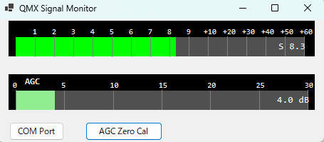

QMX Signal Monitor
QRP Labs QMX / QMX+ トランシーバーとCAT通信(SM/SAコマンド)を行い、SメーターおよびAGCメーターをリアルタイム表示するWindowsデスクトップアプリです。

上段がSメーター(この例では S 8.3)、下段がアンテナ入力ゼロ基準のAGCメーター(この例では 4.0 dB)です。左下の「COM Port」ボタンで接続ポートを選択し、「AGC Zero Cal」ボタンでAGCのゼロ点キャリブレーションを行います。
特徴 / Features
QMX/QMX+とのシリアル(CAT)通信によるリアルタイムSメーター表示
QRP Labs QMX操作マニュアルのtrue dB S-meter仕様に基づく換算(S0=-127dBm、1 S-unitあたり6dB、上限S9+36dB=-37dBm)。S9を超える分は "S9+**dB" 形式で表示
アンテナ入力ゼロ基準のAGCメーター(ゼロ点キャリブレーション機能付き)
COMポート選択画面(接続デバイスの製品名表示に対応)
動作環境 / Requirements
Windows 10 / 11 (64bit)
QMX / QMX+ トランシーバー(USBシリアル接続)
使い方 / Usage
QMX/QMX+の電源を入れ、USBケーブルでPCと接続する
アプリを起動する
初回起動時、または接続先を変更したい場合は「COM Port」ボタンからポートを選択する
「AGC Zero Cal」ボタンで、その時点でのAGC量を基準(0dB)としてキャリブレーションできる
ダウンロード / Download
最新のファイルは Releases ページから入手できます。ソースからビルドする必要はありません。2種類を用意しています。
`QMX-Signal-Monitor-standalone-win-x64.zip`(自己完結・単一ファイル、約114MB):.NETランタイムのインストール不要。解凍したexeをそのまま実行できます。
`QMX-Signal-Monitor-lite.zip`(フレームワーク依存、約521KB):事前に .NET 10 Desktop Runtime のインストールが必要です。
初回実行時の注意 / Note on first run
本アプリはコード署名を行っていない個人配布のアプリです。そのため、初回実行時にWindowsの「WindowsによってPCが保護されました」というSmartScreenの警告が表示されることがあります。これはウイルスが検出されたものではなく、まだ実行実績の少ないアプリに対する一般的な挙動です。「詳細情報」→「実行」をクリックすることで起動できます。
This app is not code-signed. Windows SmartScreen may show a warning on first run ("Windows protected your PC"). This is common for unsigned indie-developer apps and does not indicate a virus. Click "More info" → "Run anyway" to launch.
ビルド方法 / Build from source
Visual Studio 2022以降 (.NET 10 SDK)
`QMX+ S Meter 01.slnx` を開き、Release構成でビルドしてください
作者 / Author
塙 薫 (Kaoru Hanawa) / JJ1JTG
ライセンス / License
MIT License
